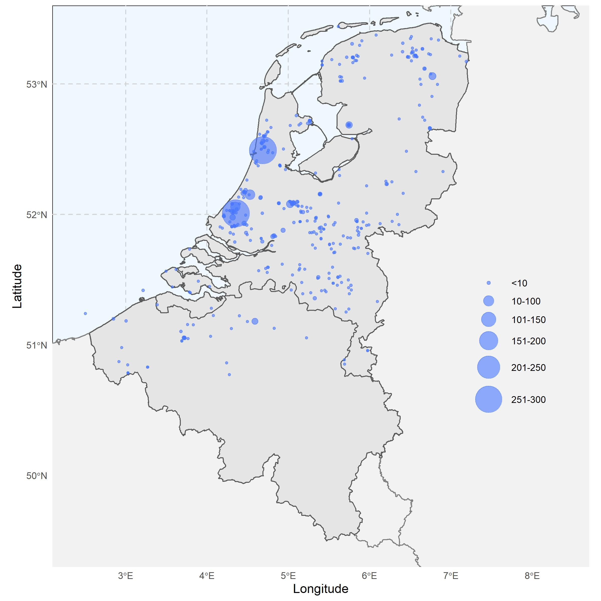

```{r ESM-fig-1, fig.cap='Find locations (n = 390) of wooden objects (n = 2155) currently hosted in WOODAN. Diameter of the circles is proportional to the number of objects recorded for that particular location.'}
library(officedown)

```


```{r ESM-fig-2, fig.cap='Number of wooden objects (n = 2155) assigned to a specific cultural period'}

knitr::include_graphics("./figures/ESM_figure_02.jpg")
```


```{r ESM-fig-3, fig.cap='Wood species used for making buckets during Roman and medieval times, as listed in WOODAN.'}

knitr::include_graphics("./figures/ESM_figure_03.jpg")
```
