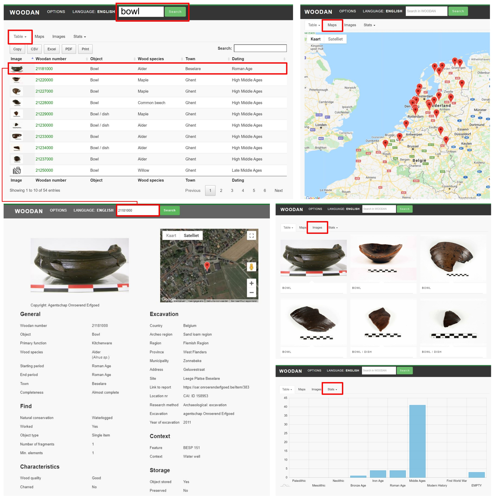

```{r setup, include=FALSE}
knitr::opts_chunk$set(echo = FALSE)
```

# Abstract

WOODAN is an online database developed to gather, present and analyse research results on archaeological wooden artefacts [[www.woodan.org](http://www.woodan.org)]. The database was released in 2017 and now contains over 2150 wooden objects found in the Netherlands and Belgium during archaeological excavations, covering finds from the Mesolithic up to the modern era (First World War). For *c.* 85% of these artefacts the wood species was identified and registered in the database. Furthermore, detailed meta-data is linked to the records, making WOODAN an excellent resource for finding comparable items and to study wood selection and craftsmanship throughout human history.

WOODAN is accessible through a highly intuitive website which allows users to query the entire database. When a query is performed the results are instantly analysed (frequency of wood species used; number of objects for each chronological period), mapped (the geographical distribution of the finds) and visually presented in an interactive display (photo's, 3D-models). An export function allows to further analyse the search results -- based on the available meta-data -- tailored to specific research questions.

Although WOODAN currently contains items from The Netherlands and Belgium only, its ambition is to become a pan-European database on archaeological wooden objects.

# Introduction

Wood is the most important renewable raw material throughout human history. Material culture, starting from early prehistory, relied on the ability to fell trees and shrubs and transform the wood into tools and objects used in daily life and architectural constructions providing shelter or a living space. Although wood is a complex organic material -- physically, chemically and as a biological tissue -- it has always been shaped and worked into new applications or it served as the basic raw material for technological innovations (Conard 2020; Rybníček et al. 2018; Tegel et al. 2012). This transformation process itself relied on technical knowledge and skill, and required apt knowledge of the physical, mechanical and aesthetical properties of the wide range of wood species available (Haneca and Deforce 2020; Klein et al. 2016; Lange et al. 2017). The study of archaeological wooden objects combined with taxonomic identifications therefore allows us to document and answer questions about our cultural past, the organization and technological craftmanship of (pre)historical societies and past forest management practices in general. In addition, this information can contribute to our understanding of the distribution of tree species in the past, including their introduction by humans, and on the import of wood as a raw material in specific regions.

Uncharred, archaeological wooden objects are only rarely preserved in the subsoil. Except for extremely wet or dry conditions, wood rapidly decays in most soil environments because of bacterial and fungal deterioration and oxidation. Under waterlogged conditions, archaeological wooden objects can be preserved for centuries. Degradation is then reduced to bacterial erosion of the cell walls, a process that advances slowly (Klaassen and van Overeem 2012), creating favourable conditions for the preservation of wooden objects. Under relatively dry conditions, close contact with metal objects can inhibit wood degradation as well and -- through the process of mineralization -- result in the (partial) preservation of wooden objects (Tegel et al. 2016; Haneca and Deforce 2020). In addition, wood can be preserved in extremely cold and/or dry conditions, such as glaciers and hyper-arid desert environments (Blanchette 2000). When such ancient objects are found, recorded and stored for further study and/or conservation, this provides a window of opportunity to gain more insight in the technological skill of the woodworker and the vegetation type the raw material originates from. Although the anatomical structure of wood essentially provides information on the functioning of trees and forests as biological systems (Beeckman 2016), the study of the internal structure of a worked piece of wood or wooden object allows to identify the species. Then the relation between the function of the object and the mechanical, technical or aesthetical properties of the wood species can be studied. When, in addition to wood species and wood use, the context in which the specific object was found is also known, the linkages between the wooden object, its function and deposit can be better understood as well (e.g. barrels re-used as well linings or wooden idols as (ritual) offerings in peat bogs).

Many taxonomic identifications on archaeological or museal wooden objects are only mentioned in reports that are often not publicly available or restricted to a footnote in elaborated archaeological reports. Therefore it is often hard to compile a substantial dataset on the wood species used for related or contemporary objects. Clearly, there is a need to develop a central repository to store, document and query the scattered finds of wooden archaeological objects in a standardized format. To fulfil this need, the WOODAN initiative was launched in 2015, as a follow-up of a project financed by the Cultural Heritage Agency of the Netherlands. The goal of this project was to provide a complete overview of all wooden artefacts found during archaeological excavations in the Netherlands, from 1997 onwards (i.e. the start of the implementation of development-led archaeology according to the Valletta Convention). The resulting catalogue and analyses were published by Lange et al. (2017). Where this book focusses primarily on categorizing and describing the many archaeological wooden finds, WOODAN was launched as an easy-to-use and online reference catalogue. In 2018 the database was embedded into the independent and newly established WOODAN Foundation (the name WOODAN refers to the Wodan-initiative in which from 2007 onwards Dutch and Irish wood specialists developed a database for wood and charcoal finds from archaeological contexts (Stuijts et al. 2010; Stuijts and O'Donnell 2011)). The newly established WOODAN Foundation is a non-profit organization with two main objectives: (1) to collect and publish information about wooden archaeological finds, and (2) to stimulate research on wooden archaeological objects.

Within the field of vegetation history and archaeobotany, several databases exist for datasets on pollen (e.g. European Pollen Database (Fyfe et al. 2009); African Pollen Database (Vincens et al. 2007)) and botanical macro remains, both from archaeological sites (e.g. ArboDat (Kreuz and Schäfer 2014); RADAR (van Haaster & Brinkkemper 1995); ABCD (Tomlinson & Hall, 1996)), and natural quaternary deposits (e.g. Late Quaternary plant macrofossil database for northern Eurasia (Binney et al. 2009)); enabling studies based on large sets of data and on large geographical scales, both in palaeoclimatology and palaeoecology (e.g. Gajewski 2008; Bartlein et al. 2011; Prentice et al. 2000) and archaeobotany (e.g. Deforce et al. 2019, Van der Veen et al. 2013). For archaeological wooden objects, no such databases existed up to now or was limited to a selection of old objects [<http://oldestwoodenobjects.net/>], hampering the study of wood use spanning different chronological periods and on a larger regional scale than individual sites or small regions.

As sharing, citation and reuse of data are key aspects to make archaeological and archaeobotanical research truly reproducible (Lodwick et al. 2019), WOODAN - as a publicly accessible repository - is able to facilitate the assessment of research findings and the reuse of data in meta-analysis.

With this paper we would like to present the current structure and content of WOODAN [[www.woodan.org](http://www.woodan.org)], showing its potential as a research tool and a stable repository to store detailed (taxonomic) information on wooden cultural heritage objects. But we also want to encourage other people that study archaeological wooden objects to contribute data, thereby increasing both the volume of the dataset and its geographical range. The objective of WOODAN is to host an easy-to-use website to search for comparable finds and to create awareness for this special finds category, which has clearly been underrepresented in archaeological studies so far.

# The database structure

The current version of WOODAN relies on a MySQL database, whilst the website uses PHP and JSON to unlock the data. WOODAN is a responsive website ensuring optimal visualization on various devices (laptop, tablet, smartphone) what allows users to consult the database in the field, during a visit to existing collections or throughout research activities.

## Database structure

In the database, each object is assigned a unique identifier, which serves as the key to link to a rich set of meta-data associated with the find. The meta-data includes information on the level of (1) the object itself, (2) the context and (3) the archaeological site or find-location (ESM Table 1).

The object itself is first described by its dimensions, completeness, natural state of preservation, degree of biological degradation and current state of conservation. A text field can complement the registered properties with specific details. At this level the taxonomic identification of the wood species is recorded, both by its botanical and vernacular name, and related to the name of the wood specialist who performed the analysis. Finally the current location of the object and preservation method or treatment is listed.

When an object is composed of different elements, each component is recorded as a sub-record. This allows us to register objects that are made of multiple parts and wood species. For instance, a fragment of a Roman harrow (id 18001000) that was found in northern Belgium, is composed of a beam (id 18001001) made out of ash (*Fraxinus excelsior*) and two inclining teeth (id 18001002) made of oak (*Quercus* sp.) (Deforce and Annaert 2007).

The object type is the main description of the object: e.g. knife, bucket, wheel, ... . On a more generalized level the primary function of the object is classified in broad categories, such as: tools, containers, weapons, transport, wickerwork, ... . Despite its primary use, an object can eventually have a secondary function, for instance a knife that was deposited as a grave good or a wheel that later became part of a water well lining. Therefore the type and function of the object is considered for both its primary and possible secondary use.

Administrative fields document the find location. Most important and mandatory fields are linked to the coordinates of the find location (WGS84). These are supplemented with the name of the country, region, province and municipality, to finally arrive at the name or toponym of the archaeological site. For objects from museum collections, the name of the museum (depot) is mentioned as the objects' current location.

The context in which the object was found refers to the interpretation of the archaeological feature, structure, site or even (archaeo- or geomorphological-) region the object is related to. Archaeological features that contain wooden objects are described and chronological information assigning the feature to a certain cultural period is added. In addition, the start and end dates are included as well, as demarcation of cultural periods differs by country or region.

Furthermore, bibliographic reference fields can be used to guide the user to the original report of the wood species identification, the excavation report or a research paper in a scientific journal or a monograph that discusses the wooden object.

As images are often the first and foremost piece of information a user of WOODAN is confronted with, it is highly promoted to add one or multiple images/drawings (and the associated copyright) of the find to the database (Fig. 1).


```{r fig_1, fig.cap='a) Iron age ladle, made of alder, Heemskerk-Beverwijk, The Netherlands, id: 16152000 (© Raf Timmermans); (b) Roman period disk wheel, oak, Sint-Denijs-Westrem, Belgium, id: 18009000 (© GATE bvba | J. Hoorne); (c) Roman period wax tablet, Silver fir, Alphen a/d Rijn, The Netherlands, id: 16201000 (© René Reijnen, Radboud University); (d) spoke wheel from the Late Middle Ages, oak, Kolham, The Netherlands, id: 16205000 (© Henk Faber Bulthuis); (e) 17th century spoon, boxwood, Ghent, Belgium, id: 21244000 (© BAAC Vlaanderen); (f) medieval plate with engravings on the bottom, beech, Antwerp, Belgium, id: 18012000 (© Flanders Heritage Agency).'}


```

## Exploring the database

A general search field allows to query WOODAN based on generic or highly specific terms. In the advanced search form multiple terms can be combined. This allows to query WOODAN in relation to specific research questions. A query results in a list of filtered objects that can be viewed in a tabular format, as a tiled view of images or as a map showing the locations of the finds. When a query is performed the results are thus instantly analysed (frequency of wood species used; number of objects for each chronological period), mapped (the geographical distribution of the finds) and visually presented in an interactive display (photo's, 3D-models). In figure 2 some screenshots are presented of WOODAN when a query for the object type 'bowl' was performed.


```{r fig_2, fig.cap='Screenshots of the WOODAN interface [[www.woodan.org](http://www.woodan.org)] showing the result of a query for the object type *bowl*, both as an overview table, a distribution map of the find locations, a mosaic of images and drawings, a bar graph showing the number of finds for each cultural period, and an example of a detailed information page for one specific object.'}


```

An export function allows to further analyse the search results -- based on the available meta-data -- tailored to specific research questions. The outcome of the query and related meta-data fields can then be downloaded into a comma separated date file for more detailed analysis.

# Current dataset

Currently (26/07/2021), WOODAN hosts 2155 objects, of which 89 are composite objects made of multiple elements and different wood species. In total 2279 elements are recorded. These finds originate from 390 different find locations in The Netherlands and Belgium (ESM Fig. 1). Few of them are related to finds situated off-coast in the North Sea.

Only few objects have been radiocarbon dated or have a felling date established by tree-ring analysis. Therefore the age of the majority of the objects is based on associated finds or the cultural period assigned to the archaeological feature or site where the object was found. WOODAN is currently dominated by finds from the Middle Ages (n = 874), followed by Roman (n = 395) and Iron age (n = 354) objects (for a complete overview we refer to ESM Fig. 2). A limited number of finds (n = 3) are associated with a very narrow time window -- the First World War (1914-1918) -- and were found along the former battlefield in western Flanders (Haneca et al. 2018).

# Scientific value

83.5% of all wooden elements in WOODAN are accompanied by a taxonomic identification. Although one knife handle is supposed to originate from the Paleolithic, taxonomic identification was not performed on this item. Hence, the oldest finds in WOODAN that have a taxonomic identification of the wood species date to the Mesolithic, and represent axe handles, spear shafts, bows and paddles made of ash, dogwood and maple. Most recent finds are related to the First World War. Although dominated by finds from the Middle Ages, the current dataset of wooden finds in WOODAN clearly covers multiple periods, dating back to the Mesolithic and therefore already allows us to discern trends and changes in wood use and technology.

Most common wood species used for making wooden objects are alder (*Alnus* sp.), oak (*Quercus* sp.) and ash (*Fraxinus excelsior*), but up to 25 other hardwood species and 5 softwoods were recorded as well (Fig. 3), of which some are not indigenous and must have been imported along long-distance trade routes; e.g. silver fir (*Abies alba*) does not grow in the Low Countries but is recorded from the Roman period onwards.

Rare wood species seem to be related to specific types of objects. Yew (*Taxus baccata*) for instance is often related to the manufactory of stave buckets, cups and bows, whilst box (*Buxus sempervirens*) is almost strictly used for making combs. Nonetheless, when differentiating among cultural periods it is noted that buckets made of *Taxus* nearly exclusively occur on early medieval sites; a new tradition which disappears again in the High Middle Ages (ESM Fig. 3).

Even from this first screening of the current content of WOODAN it becomes clear that the exploitation of the wood species differs among cultural periods. Furthermore it is apparent that composite objects with multiple parts and wood species become increasingly important from Roman times onwards. Beech was not used for making objects before the Late Iron Age, which concurs with the paleoecology and late recolonization of this thermophilic species since the last glacial period.

```{r fig_3, fig.cap='Occurrence of wood species used for creating objects or specific components, across cultural periods. The first line shows the number of composite objects made of multiple elements and wood species.'}


```


As such, WOODAN allows both professional users and the interested public to find wooden objects based on specific criteria such as period, wood species or type of object. This allows to postulate statements about the rareness of certain objects, or the use of specific wood species, and to make informed decisions about conservation treatment.

# Outlook

In 2018 the database has been accommodated within the WOODAN Foundation ([info\@woodan.org](mailto:info@woodan.org)) and in 2019 Flanders Heritage Agency joined the project. Currently the database is fed with archaeological objects from Belgium and the Netherlands on which wood species identification was performed. The goal is to further expand WOODAN with wooden objects and their taxonomic identifications. WOODAN aims at becoming a sustainable repository for taxonomic identifications of (pre-)historical wooden objects excavated during archaeological fieldwork or from museum collections. Not only for the Low Countries, but we hope other European institutes, wood specialists and archaeologists outside the current geographical range of WOODAN will join this initiative. Interested parties who a willing to contribute to the further development of the database are encouraged to contact the authors. We are aware that data entry and curation requires the input of experts -- both in wood science as archaeology or cultural studies -- and is highly time-consuming. To tackle this, the WOODAN Foundation is actively applying for project funding to local authorities and strives to co-operate with archaeological depots and (scientific) institutes. As of October 2021, a proposal to catalogue and synthesize archaeological wooden objects found during development-led projects in Flanders was granted by Flanders Heritage Agency. This will allow to further expand and develop WOODAN, and to launch an online module to facilitate direct data entry of wooden items into the database. Data contributors will then be able to directly enter information on analysed wooden objects into the WOODAN database. A review committee will cross-check and validate new entries before they become visible online in the database.

On the longer perspective, a richly filled database with wooden archaeological objects and associated taxonomic identifications would stimulate more detailed research on a (supra-) regional or international scale. To facilitate this, WOODAN has already become a multi-lingual platform on which users can search for objects or object groups in four languages (Dutch, English, French and German).

We hope this platform will stimulate the inclusion and appreciation of wood technological and botanical research on wooden objects into archaeological projects. Furthermore, this repository, as it can be easily browsed, could serve as a platform to create more awareness and interest for archaeological wooden heritage towards a broad audience.


# References


Bartlein PJ, Harrison SP, Brewer S, Connor S, Davis BAS, Gajewski K, Guiot J, Harrison-Prentice TI, Henderson A, Peyron O, Prentice IC, Scholze M, Seppä H, Shuman B, Sugita S, Thompson RS, Viau AE, Williams J, Wu H (2011) Pollen-based continental climate reconstructions at 6 and 21ka: a global synthesis. Clim Dyn 37:775--802. <https://doi.org/10.1007/s00382-010-0904-1>

Beeckman H (2016) Wood anatomy and trait-based ecology. IAWA Journal 37:127--151. <https://doi.org/10.1163/22941932-20160127>

Binney HA, Willis KJ, Edwards ME, Bhagwat SA, Anderson PM, Andreev AA, Blaauw M, Damblon F, Haesaerts P, Kienast F, Kremenetski KV, Krivonogov SK, Lozhkin AV, MacDonald GM, Novenko EY, Oksanen P, Sapelko TV, Väliranta M, Vazhenina L (2009) The distribution of late-Quaternary woody taxa in northern Eurasia: evidence from a new macrofossil database. Quaternary Science Reviews 28:2445--2464. <https://doi.org/10.1016/j.quascirev.2009.04.016>

Blanchette RA (2000) A review of microbial deterioration found in archaeological wood from different environments. International Biodeterioration & Biodegradation 46:189--204. [https://doi.org/10.1016/S0964-8305(00)00077-9](https://doi.org/10.1016/S0964-8305(00)00077-9)

Conard NJ, Serangeli J, Bigga G, Rots V (2020) A 300,000-year-old throwing stick from Schöningen, northern Germany, documents the evolution of human hunting. Nature Ecology & Evolution 4:690--693. <https://doi.org/10.1038/s41559-020-1139-0>

Deforce K, Annaert R (2007) An early Roman Age harrow from Poppel, Belgium. Archaologisches Korrespondenzblatt 37:85--94

Deforce K, Brinkkemper O, van Haaster H, Van Waijjen M (2019) Small things can make a big difference: a comparison of pollen and macrobotanical records of some food plants from medieval and post-medieval cesspits in the Netherlands and northern Belgium. Veget Hist Archaeobot 28:433--445. <https://doi.org/10.1007/s00334-018-0706-7>

Fyfe RM, de Beaulieu J-L, Binney H, Bradshaw RHW, Brewer S, Le Flao A, Finsinger W, Gaillard M-J, Giesecke T, Gil-Romera G, Grimm EC, Huntley B, Kunes P, Kühl N, Leydet M, Lotter AF, Tarasov PE, Tonkov S (2009) The European Pollen Database: past efforts and current activities. Veget Hist Archaeobot 18:417--424. <https://doi.org/10.1007/s00334-009-0215-9>

Gajewski K (2008) The Global Pollen Database in biogeographical and palaeoclimatic studies: Progress in Physical Geography. <https://doi.org/10.1177/0309133308096029>

Haneca K, Deforce K (2020) Wood use in early medieval weapon production. Archaeol Anthropol Sci 12:9. <https://doi.org/10.1007/s12520-019-01000-5>

Haneca K, van Daalen S, Beeckman H (2018) Timber for the trenches: a new perspective on archaeological wood from First World War trenches in Flanders Fields. Antiquity 92:1619--1639. <https://doi.org/10.15184/aqy.2018.172>

Klaassen RKWM, van Overeem BS (2012) Factors that influence the speed of bacterial wood degradation. Journal of Cultural Heritage 13:129--134. <https://doi.org/10.1016/j.culher.2012.02.016>

Klein A, Bockhorn O, Mayer K, Grabner M (2016) Central European wood species: characterization using old knowledge. J Wood Sci 62:194--202. <https://doi.org/10.1007/s10086-015-1534-3>

Lange S, Kruisman RR, van der Laan J, Nicolay S (2017) Uit het juiste hout gesneden: houten gebruiksvoorwerpen uit archeologische context tot 1300 n. Chr. Rijksdienst voor het Cultureel Erfgoed, Amersfoort

Lodwick L (2019) Sowing the seeds of future research: data sharing, citation and reuse in archaeobotany. Open Quaternary 5:7. <https://doi.org/10.5334/oq.62>

Prentice IC, Jolly D (2000) Mid-Holocene and glacial-maximum vegetation geography of the northern continents and Africa. Journal of Biogeography 27:507--519. <https://doi.org/10.1046/j.1365-2699.2000.00425.x>

Rybníček M, Chlup T, Kalábek M, Kalábková P, Kočár P, Kyncl T, Muigg B, Tegel W, Vostrovská I, Kolář T (2018) New dendroarchaeological evidence of water well constructions reveals advanced Early Neolithic craftsman skills. Dendrochronologia 50:98--104. <https://doi.org/10.1016/j.dendro.2018.06.003>

Stuijts I, O'Donnell L (2011) Working with WODAN -- an online charcoal database. In: Badal E, Carrión Y, Grau E, et al. (eds) 5th international meeting of charcoal analysis. The charcoal as cultural and biological heritage. Sagvntvm. Papeles del laboratorio de arqueología de Valencia 11:17--18.

Stuijts I, O'Donnell L, Lysons S, Corns A, McAuley J, Shaw R, Bunce A, O'Sullivan K (2010) WODAN---a database for wood and charcoal identifications. Archaeology Ireland 24:40--42.

Tegel W, Elburg R, Hakelberg D, Stäuble H, Büntgen U (2012) Early Neolithic water wells reveal the world's oldest wood architecture. PLoS ONE 7:e51374. <https://doi.org/10.1371/journal.pone.0051374>

Tegel W, Muigg B, Büntgen U (2016) The wood of Merovingian weaponry. Journal of Archaeological Science 65:148--153. <https://doi.org/10.1016/j.jas.2015.11.011>

van der Veen M, Livarda A, Hill A (2008) New plant foods in Roman Britain --- dispersal and social access. Environmental Archaeology 13:11--36. <https://doi.org/10.1179/174963108X279193>

van Haaster H, Brinkkemper O (1995) RADAR, a relational archaeobotanical database for advanced research. Vegetation History and Archaeobotany 117--125. <https://doi.org/10.1007/BF00206920>

Vincens A, Lézine A-M, Buchet G, Lewden D, Le Thomas A (2007) African pollen database inventory of tree and shrub pollen types. Review of Palaeobotany and Palynology 145:135--141. <https://doi.org/10.1016/j.revpalbo.2006.09.004>

# ESM

```{r ESM_fig_1, fig.cap=' '}

knitr::include_graphics("./figures/ESM_figure_01.jpg")
```


```{r ESM_fig_2, fig.cap=' '}


```


```{r ESM_fig_3, fig.cap=' '}


```
